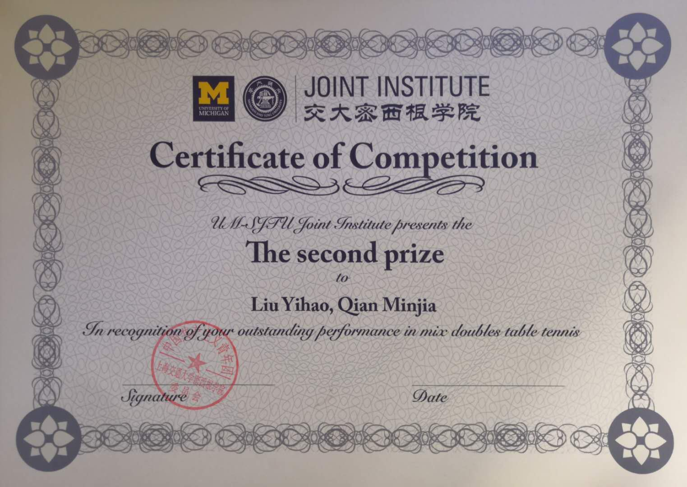
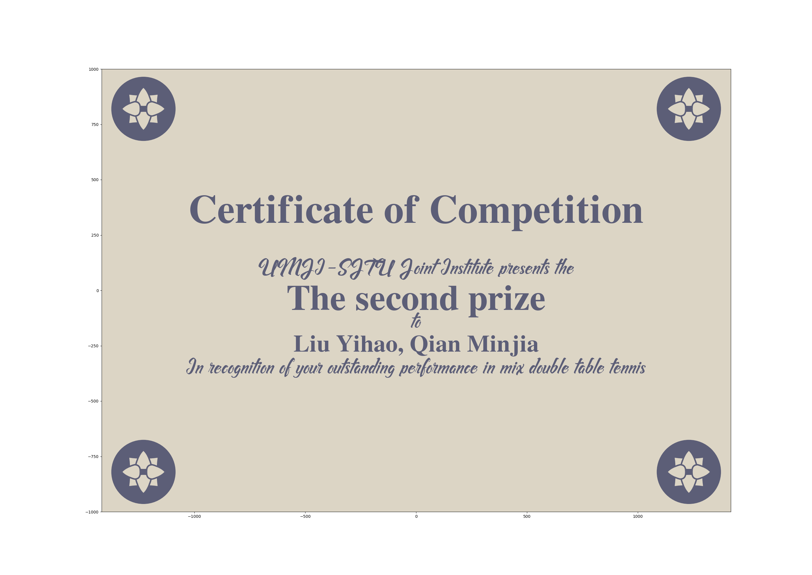

# Pingpong Certificate

MJJ and I won the second prize in the mix double table tennis competition in JI.

MJJ asked me to make a certificate with python since there is only one paper certificate for both of us.

It would be quite interesting to draw pictures with pyplot.

The paper certificate:

The digital certificate:

